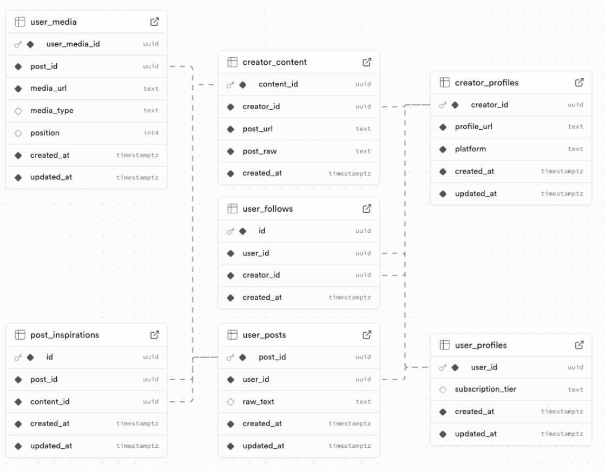

# Project Name: Muse - Team 1

## Database Design

Table containing constraints, pk, fk, etc. extra information

https://docs.google.com/spreadsheets/d/1CksnrYIqFs90kd9xkaRTjEDNLkYb8VTkrjm9DpjtiEo/edit?gid=2144144581#gid=2144144581

### Overview

Brief description of your data model and why it supports your application.

### Entity Relationship Diagram



### Tables Description

- **user_profiles**: Stores user account information

  - `user_id` (UUID, PK): Unique user identifier
  - `subscription_tier` (TEXT): Either 'free' or 'pro'
  - `created_at`, `updated_at` (TIMESTAMPTZ): Auto-managed timestamps

- **creator_profiles**: Stores external creators that users can follow

  - `creator_id` (BIGINT, PK): Auto-incrementing ID (GENERATED ALWAYS)
  - `profile_url` (TEXT): Creator's profile URL (must start with http:// or https://)
  - `platform` (TEXT): Social media platform
  - `created_at`, `updated_at` (TIMESTAMPTZ): Auto-managed timestamps
  - Unique index on lowercased `(platform, profile_url)` combination

- **creator_content**: Stores posts/content from creators

  - `content_id` (BIGINT, PK): Auto-incrementing ID (GENERATED BY DEFAULT)
  - `creator_id` (BIGINT, FK): References creator_profiles
  - `post_url` (TEXT): URL to the creator's post
  - `post_raw` (TEXT): Raw content text (optional)
  - `created_at`, `updated_at` (TIMESTAMPTZ): Auto-managed timestamps
  - Cascade delete when creator is deleted

- **user_posts**: Stores posts created by users

  - `post_id` (UUID, PK): Auto-generated UUID
  - `user_id` (UUID, FK): References user_profiles
  - `raw_text` (TEXT): Post content (optional)
  - `created_at`, `updated_at` (TIMESTAMPTZ): Auto-managed timestamps
  - Cascade delete when user is deleted

- **user_media**: Stores media attachments for user posts

  - `user_media_id` (UUID, PK): Unique media identifier
  - `post_id` (UUID, FK): References user_posts
  - `media_url` (TEXT): URL to media file
  - `media_type` (TEXT): Type of media (optional)
  - `created_at`, `updated_at` (TIMESTAMPTZ): Auto-managed timestamps
  - Cascade delete when post is deleted

- **user_follows**: Tracks which creators users follow

  - `id` (UUID, PK): Auto-generated UUID
  - `user_id` (UUID, FK): References user_profiles
  - `creator_id` (BIGINT, FK): References creator_profiles
  - `created_at` (TIMESTAMPTZ): When the follow occurred
  - Unique constraint on `(user_id, creator_id)` pair
  - Cascade delete when user or creator is deleted

- **post_inspirations**: Links user posts to creator content that inspired them
  - `id` (BIGINT, PK): Auto-incrementing ID (GENERATED ALWAYS)
  - `post_id` (UUID, FK): References user_posts
  - `content_id` (BIGINT, FK): References creator_content
  - `created_at`, `updated_at` (TIMESTAMPTZ): Auto-managed timestamps
  - Unique constraint on `(post_id, content_id)` pair
  - Cascade delete when post or content is deleted

### Security Model

Explanation of your RLS policies and access control strategy.

## Setup Instructions

### Prerequisites

- Python 3.10+
- Supabase account
- pip (Python package manager)
- Relevant libraries:
  - `supabase` - Supabase Python client
  - `python-dotenv` - Environment variable management
  - `httpx` - HTTP client for API requests

### Installation

1. Install required packages:

```bash
pip install supabase python-dotenv httpx
```

2. Copy `.env.example` to `.env` and configure:

```bash
cp .env.example .env
```

3. Update `.env` with your Supabase credentials:

```
SUPABASE_URL=https://your-project-id.supabase.co
SUPABASE_ANON_KEY=your-anon-key-here

# Test user credentials (for authenticated testing)
TEST_USER_EMAIL=your-test-email@example.com
TEST_USER_PASSWORD=your-test-password
```

### Running the test scripts

Run the connection test:

```bash
python3 test_connection.py
```

When prompted, choose:

- `y` to run authenticated tests (uses credentials from `.env`)
- `n` to run anonymous tests only
